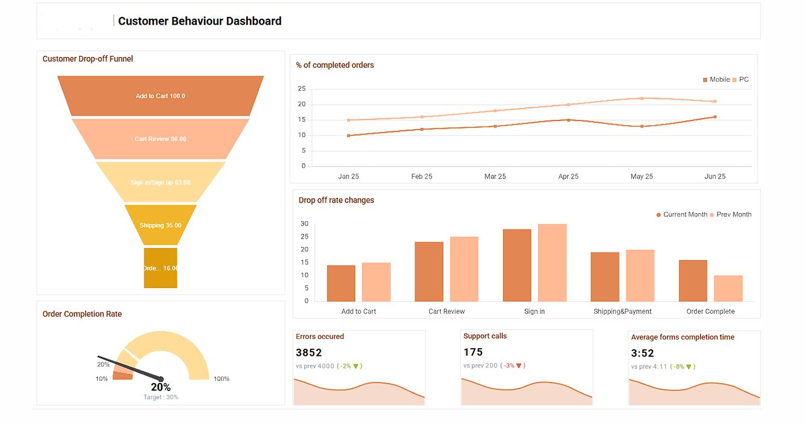

# Sales-Funnel-Analysis
# Customer Behaviour Dashboard

This repository contains a dashboard for analyzing customer behavior in an e-commerce sales funnel. The dashboard provides insights into how customers interact with the sales process, where they drop off, and various performance metrics.

## Dashboard Overview

The dashboard is visually represented as shown below:

 

### Key Components

1. **Customer Drop-off Funnel**  
   - Visually represents the number of users at each stage of the sales funnel:
     - Add to Cart (100)
     - Cart Review (86)
     - Sign in/Sign up (63)
     - Shipping (35)
     - Order Complete (16)
   - Helps identify at which stages customers are dropping off most frequently.

2. **% of Completed Orders**  
   - Line chart showing the percentage of completed orders over time.
   - Data is segmented by device type (Mobile vs PC).
   - Enables tracking of order completion trends and device-specific performance.

3. **Drop-off Rate Changes**  
   - Bar chart comparing drop-off rates for each funnel stage between the current month and the previous month.
   - Useful for monitoring improvements or regressions in customer retention at each stage.

4. **Order Completion Rate**  
   - Gauge chart displaying the current order completion rate (20%), compared to a target value (30%).
   - Provides a quick snapshot of how close you are to your conversion goals.

5. **Key Performance Indicators (KPIs)**
   - **Errors Occurred**: Number of errors detected (3,852), with comparison to the previous period and percentage change.
   - **Support Calls**: Number of support calls (175), with period-over-period comparison.
   - **Average Form Completion Time**: Average time to complete forms (3:52), compared to the previous period.

## Insights

- The funnel highlights significant customer drop-off at each stage, especially between 'Sign in/Sign up' and 'Shipping'.
- The order completion rate is below the target, indicating potential issues in the funnel that need to be addressed.
- KPIs show slight improvements in errors and support calls, as well as faster form completion times.

## Usage

This dashboard is intended for use by analysts, product managers, and anyone interested in optimizing the customer journey and increasing sales funnel efficiency.

---

**Note:**  
Replace the image path in the markdown with the actual location of your image if it is different from the placeholder.
